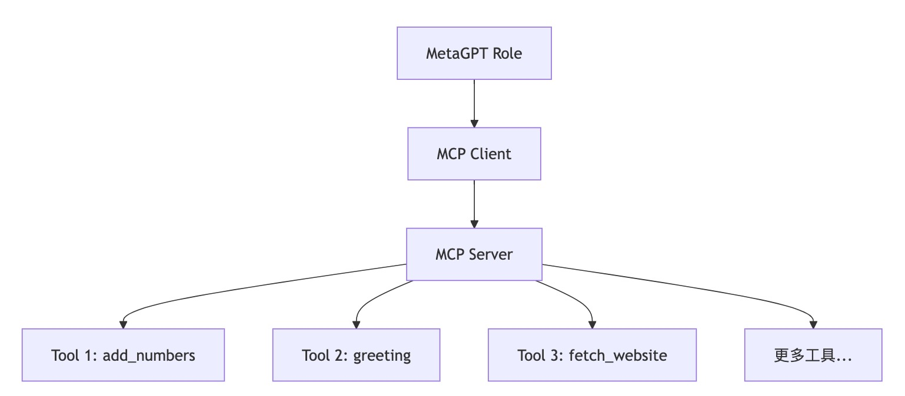

# MCP4MetaGPT

MCP4MetaGPT 是一个把 MCP 工具集成到 MetaGPT 的多功能工具服务框架，旨在通过统一的接口提供灵活的工具处理能力。该项目支持多种工具调用、日志记录以及异步操作。

## 项目功能

- **工具处理器**：支持动态注册和调用工具，例如加法运算 (`add_numbers`) 和个性化问候 (`greeting`)。
- **日志支持**：内置日志记录功能，便于调试和监控。
- **异步支持**：基于 `asyncio` 的异步编程模型，提升性能和响应速度。
- **可扩展性**：通过定义新的工具和角色，轻松扩展系统功能。

## 项目结构

以下是项目的目录结构及主要文件的功能说明：

```
.
├── README.md                  # 项目说明文档
├── mcp_integrated_role.py     # 核心集成逻辑
├── mcp_server.py              # MCP 服务器实现
```

## 项目架构



### 主要模块说明

1. **MCPIntegratedRole**
   - 定义在 `mcp_integrated_role.py` 中。
   - 继承自 `metagpt.roles.Role`，用于实现与 MetaGPT 的集成。

2. **MCP 服务器**
   - 定义在 `mcp_server.py` 中。
   - 提供工具处理器 (`tool_handler`) 和工具列表 (`list_tools`) 功能。
   - 支持的工具包括：
     - `add_numbers`：对两个整数进行加法运算。
     - `greeting`：生成个性化的问候语。

3. **MetaGPT 集成**
   - 定义在 `metagpt_integration.py` 中。
   - 包含日志配置和异步主函数。

## 使用方法

### 运行项目

1. 确保已安装 Python 3.8+。
2. 安装依赖：
   ```bash
   pip install -r requirements.txt
   ```
3. 启动 MCP 服务器：
   ```bash
   python mcp_server.py
   ```

### 调用工具

```python
from mcp_integrated_role import MCPIntegratedRole

role = MCPIntegratedRole(
    name="MCPAgent",
    profile="MCP Integrated Agent",
    goal="Use MCP tools",
    constraints=""
)

role.run()
```

## 扩展开发

如需添加新工具，请参考 `mcp_server.py` 中的 `tool_handler` 和 `list_tools` 函数实现。确保为每个工具定义输入参数的 JSON Schema，并在 `list_tools` 中注册。

## 联系我

如有任何问题或建议，请随时联系我：


